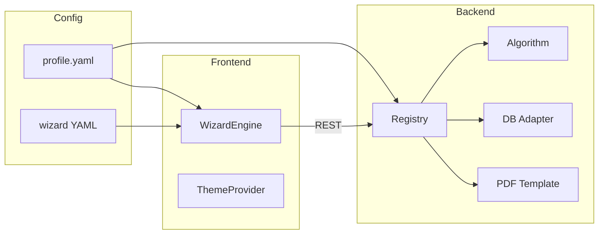

# Архитектура PumpStation Base

## Цель

Платформа подбора насосных станций с **конфигурируемым** UI, алгоритмом, БД и PDF без переписывания ядра. Проект рассчитан на сопровождение через Cursor людьми без опыта программирования: основная работа ведётся в YAML/JSON и текстах, код трогается реже.

## Референс UI

Шаблон: `http://159.194.215.53/` (продукт «Стрела», Replit + Vite + React).

Поток экранов (насосные установки):

1. **Класс продукции** — карточки (гидромодули, насосные установки, …)
2. **Линейка** — например BPS-W
3. **Тип сети** — хоз-пит / ПНС
4. **Форма подбора** — параметры, кнопка «Подобрать», опции, «Сформировать станцию», блок результата и PDF

## Принципы

| Принцип | Реализация |
|--------|------------|
| Конфиг вместо кода | Визард, тексты, видимость полей — в `config/profiles/*/wizard/` |
| Профиль (tenant) | Один `profile.yaml` включает тему, алгоритм, БД, шаблон PDF |
| Плагины | Реестр в backend: `algorithms/`, `db/adapters/`, `pdf/templates/` |
| Контракт API | OpenAPI + общие типы в `packages/contracts` |
| Безопасные зоны для редакторов | `config/`, `context/`, тексты в `packages/theme-*/` |

## Структура репозитория

```
PumpStation_Base/
├── config/profiles/{profileId}/   # ← главная зона правок
│   ├── profile.yaml
│   ├── branding.yaml
│   └── wizard/
├── apps/web/                      # React: рендер по конфигу
├── apps/api/                      # FastAPI: алгоритм, БД, PDF
├── packages/
│   ├── contracts/                 # схемы запросов/ответов
│   ├── wizard-schema/             # JSON Schema для YAML визарда
│   └── theme-{name}/              # CSS-токены, ассеты
├── context/                       # заметки проекта (хосты, ключи)
└── conductor/                     # product / tech-stack для AI
```

## Профиль (`profile.yaml`)

```yaml
id: strela-default
displayName: Стрела — демо
theme: theme-strela
algorithm: bps_w_v1          # модуль в apps/api/app/algorithms/
database: postgres           # адаптер в apps/api/app/db/adapters/
pdfTemplate: strela-standard # apps/api/app/pdf/templates/
wizardRoot: wizard/navigation.yaml
```

Смена заказчика = новая папка `config/profiles/acme/` + при необходимости новый пакет темы или шаблон PDF.

## Визард (config-driven)

- `navigation.yaml` — дерево шагов (card-grid → card-grid → form)
- `flows/*.yaml` — поля формы, валидация, значения по умолчанию, привязка к API

Фронтенд (`WizardEngine`) читает конфиг и рисует:

- `ProductClassStep` — сетка карточек
- `ProductLineStep` — линейка
- `SelectionFormStep` — поля + вызов API подбора

Добавление шага = запись в YAML, без нового React-компонента (если тип шага уже есть в движке).

## Backend

```
POST /api/v1/selection/match-pumps      # подбор насосов
POST /api/v1/selection/build-station    # конфигурация станции
POST /api/v1/selection/generate-pdf     # PDF по profile.pdfTemplate
GET  /api/v1/config/profile             # активный профиль + branding для фронта
```

Реестр (`app/core/registry.py`) по имени из `profile.yaml` подставляет:

- `AlgorithmProtocol.match_pumps()`, `build_station()`
- `DatabaseAdapter` — каталоги, справочники
- `PdfRenderer` — Jinja2 + WeasyPrint / reportlab (на выбор при внедрении)

## Смена внешнего вида

1. **Быстро** — `branding.yaml` (цвета, логотип, шрифты, `layoutVariant`)
2. **Глубже** — пакет `packages/theme-{name}/tokens.css`
3. **Другой layout** — `layoutVariant`: `sidebar-brand` | `topbar-dark` | `minimal-light` | `sidebar-gradient`
4. **По аккаунту** — `config/accounts/users.yaml` → `profileId`

## PDF и тема (связанная пара)

| theme | pdfTemplate |
|-------|-------------|
| theme-strela | strela-standard |
| theme-acme | acme-datasheet |
| theme-nord | nord-compact |
| theme-aqua | aqua-report |

Шаблоны HTML: `apps/api/app/pdf/templates/<pdfTemplate>/template.html` — стили из `branding.colors`.

## Смена алгоритма

1. Папка `apps/api/app/algorithms/bps_w_v2/`
2. Регистрация в `algorithms/__init__.py`
3. В профиле: `algorithm: bps_w_v2`

Старый алгоритм не удаляется — параллельные версии для A/B и разных клиентов.

## Смена БД

Адаптеры с общим интерфейсом: `PostgresAdapter`, `SqliteAdapter`, `MockAdapter` (для разработки без БД).

## Смена PDF

`apps/api/app/pdf/templates/{name}/` — шаблон + маппинг полей из результата подбора.

## Пользователи

- Демо: `config/accounts/users.yaml` + JWT (`POST /api/v1/auth/login`)
- `GET /api/v1/auth/session` — профиль по токену или гостевой `APP_PROFILE_ID`
- Визард требует входа; PDF генерируется только для профиля, создавшего подбор

## Диаграмма потока



## Рекомендации для редакторов без кода

1. Менять только файлы в `config/profiles/...` и `context/`
2. После правок YAML проверять синтаксис (Cursor подскажет)
3. Для новых полей формы — копировать блок поля из существующего flow
4. Не трогать `apps/*/src` без задачи от разработчика

Подробнее: `AGENTS.md`, `context/template-reference.md`.
